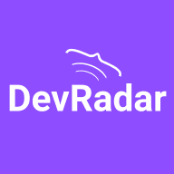

 
 

<i>🚀 Projeto feito durante a Semana Omnistack 10 - <a  href="https://github.com/Rocketseat">Rocketseat</a></i>

Está procurando um novo membro para compor o seu time? O DevRadar pode te ajudar nessa missão, se liga:
O objetivo é unir desenvolvedores geograficamente próximos, filtrando os resultados com base nas tecnologias que você possui interesse.

### Como funciona? 💡
1. O dev cadastra o GitHub e as tecnologias que domina na página web do DevRadar.
2. Você insere as tecnologias que possui interesse no App e todos os devs cadastrados que estejam a 10km de você e que possuem uma ou mais tecnologias que você procura aparecerão no mapa.
3. Você pode clicar na foto do Dev e analisar o GitHub dele dentro do App. Ah, caso algum dev se cadastre enquanto você estiver utilizando o App, ele aparecerá no seu mapa sem que você precise atualizar a pesquisa.

### Tecnologias utilizadas 💙
* NodeJs - Express
* MongoDB

### Minhas modificações 🔧
* Criação da rota e do método update no controller de devs
* Criação da rota e do método destroy no controller de devs
* Inserção de variáveis de ambiente

### Rotas 🗺️
- `GET/devs` - Retorna todos os desenvolvedores cadastrados.
- `POST/devs` - Cria um novo desenvolvedor.
- `PUT/devs/:id` – Altera informações de um desenvolvedor cadastrado.
- `DELETE/devs/:id` – Deleta um desenvolvedor cadastrado.
- `GET/search` - Filtra devs por latitude, longitude e tecnologias cadastradas.
- `GET/ping` – Utilizado para teste.

### Utilização 🔌
1. Clone este repositório
2. Instale as dependências rodando `yarn install` ou `npm install`
3. Crie um arquivo .env e configure as variáveis de ambiente seguindo o exemplo do arquivo .env.example
4. Rode a API executando `yarn start` ou `npm run start`, se for desenvolver utilize o `yarn dev` ou `npm run dev`
5. Para utilizar a interface Web siga o passo a passo do [DevRadar-Web](https://github.com/ViniciusMazon/DevRadar-Web)
6. Para utilizar o App siga o passo-a-passo do [DevRadar-Mobile](https://github.com/ViniciusMazon/DevRadar-Mobile) 

### Todos repositórios 📦
* [API](https://github.com/ViniciusMazon/DevRadar-API)
* [Web](https://github.com/ViniciusMazon/DevRadar-Web)
* [Mobile](https://github.com/ViniciusMazon/DevRadar-Mobile)

### Licença 📄
Esse projeto está sob a licença **MIT**.

**Por favor, deixe seu feedback, ele é muito importante para meu crescimento**
**Se gostou, não esqueça de dar uma estrela** 😆